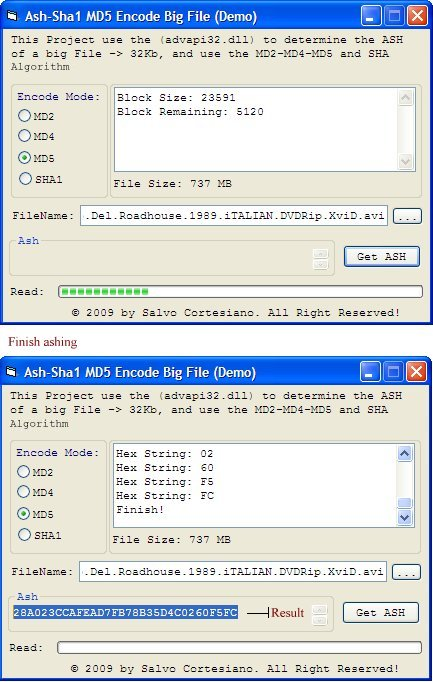



## How to use \(advapi32\.dll\) to Get ASH \(MD2\-MD4\-MD5\-SHA\) Algorithm of very Big File\!

### Description

This Project use the (advapi32.dll) to determine the ASH of a big File -&gt; 32Kb, and Get the MD2-MD4-MD5 and SHA Algorithm! I hope there is useful :)

Happy Coding (VB)....
 
### More Info
 

             |
---                |---
**Submitted On**   |2009-04-27 20:00:02
**By**             |[Salvo Cortesiano \(Italy\)](https://github.com/Planet-Source-Code/PSCIndex/blob/master/ByAuthor/salvo-cortesiano-italy.md)
**Level**          |Advanced
**User Rating**    |5.0 (25 globes from 5 users)
**Compatibility**  |VB 6\.0
**Category**       |[Coding Standards](https://github.com/Planet-Source-Code/PSCIndex/blob/master/ByCategory/coding-standards__1-43.md)
**World**          |[Visual Basic](https://github.com/Planet-Source-Code/PSCIndex/blob/master/ByWorld/visual-basic.md)
**Archive File**   |[How\_to\_use2150884272009\.zip](https://github.com/Planet-Source-Code/salvo-cortesiano-italy-how-to-use-advapi32-dll-to-get-ash-md2-md4-md5-sha-algorithm-of-ver__1-72043/archive/master.zip)

